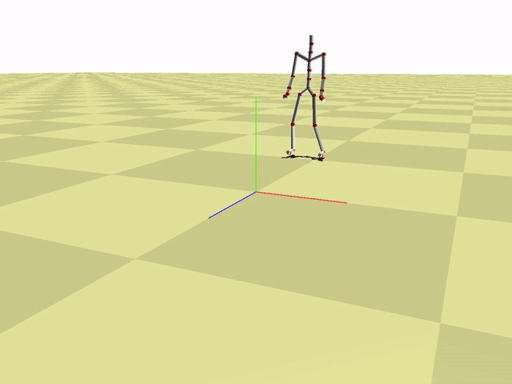

# Motion Capture Interpolation 💀

Interpolation schemes to interpolate human motion data. (see [Report](Motion_Capture_Interpolation_Report.pdf))

> The image shows the input motion in red, and the interpolated motion in green.

## Features ✨

- [x] Conversions between Euler angles, rotations matrix, and quaternions
- [x] Interpolation schemes (linear Euler, Bezier Euler, linear quaternion and Bezier quaternion)
